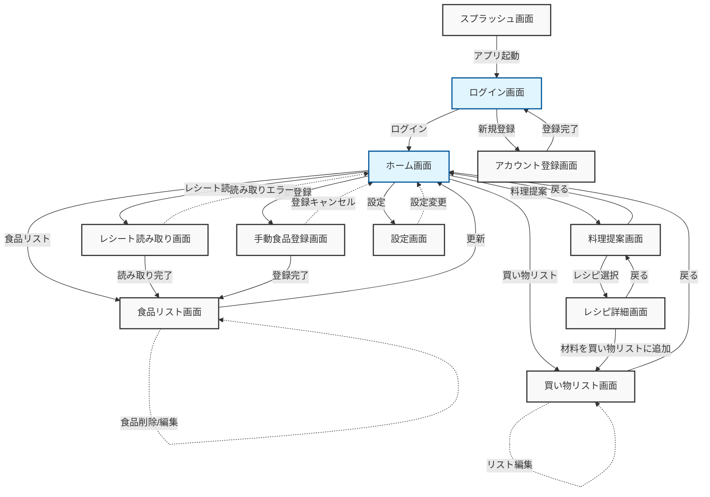

# 食品登録・料理提案アプリの画面遷移図

このドキュメントでは、レシート読み取りと食品登録から料理提案までの機能を持つアプリケーションの画面遷移を図示し、説明します。

## 画面遷移図

## 画面説明

1. **スプラッシュ画面**:
   - アプリ起動時に表示される初期画面
   - 自動的にログイン画面へ遷移

2. **ログイン画面**:
   - ユーザー認証を行う
   - ログイン成功後、ホーム画面へ遷移
   - 新規ユーザーはアカウント登録画面へ遷移可能

3. **アカウント登録画面**:
   - 新規ユーザーがアカウントを作成
   - 登録完了後、ログイン画面に戻る

4. **ホーム画面**:
   - アプリのメイン画面
   - 各主要機能へのアクセスポイント
   - レシート読み取り、手動登録、食品リスト、料理提案、買い物リスト、設定へのボタンを配置

5. **レシート読み取り画面**:
   - カメラでレシートを読み取る
   - 読み取り完了後、食品リスト画面へ遷移
   - 読み取りエラー時はホーム画面に戻る

6. **手動食品登録画面**:
   - 手動で食品を入力・登録
   - 登録完了後、食品リスト画面へ遷移
   - 登録キャンセル時はホーム画面に戻る

7. **食品リスト画面**:
   - 登録された全ての食品を表示
   - 食品の削除や編集が可能
   - 更新後、ホーム画面に戻ることが可能

8. **料理提案画面**:
   - 登録された食品から作れる料理を提案
   - 提案されたレシピを選択すると、レシピ詳細画面へ遷移

9. **レシピ詳細画面**:
   - 選択したレシピの詳細情報を表示
   - 料理提案画面に戻ることが可能
   - 必要な材料を買い物リストに追加する機能あり

10. **買い物リスト画面**:
    - ユーザーの買い物リストを表示・編集
    - ホーム画面から直接アクセス可能
    - レシピ詳細画面から材料を直接追加可能

11. **設定画面**:
    - アプリの各種設定を変更
    - 設定変更後、ホーム画面に戻る

## まとめ

この画面遷移図は、食品登録・料理提案アプリの主要な機能と画面間の関係を視覚的に表現しています。ユーザーの行動フローを考慮し、直感的な操作が可能となるよう設計されています。開発チームはこの図を基に、各画面の詳細設計やユーザーインターフェースの作成を進めることができます。また、今後の機能追加や変更の際にも、この図を参照点として使用できます。
