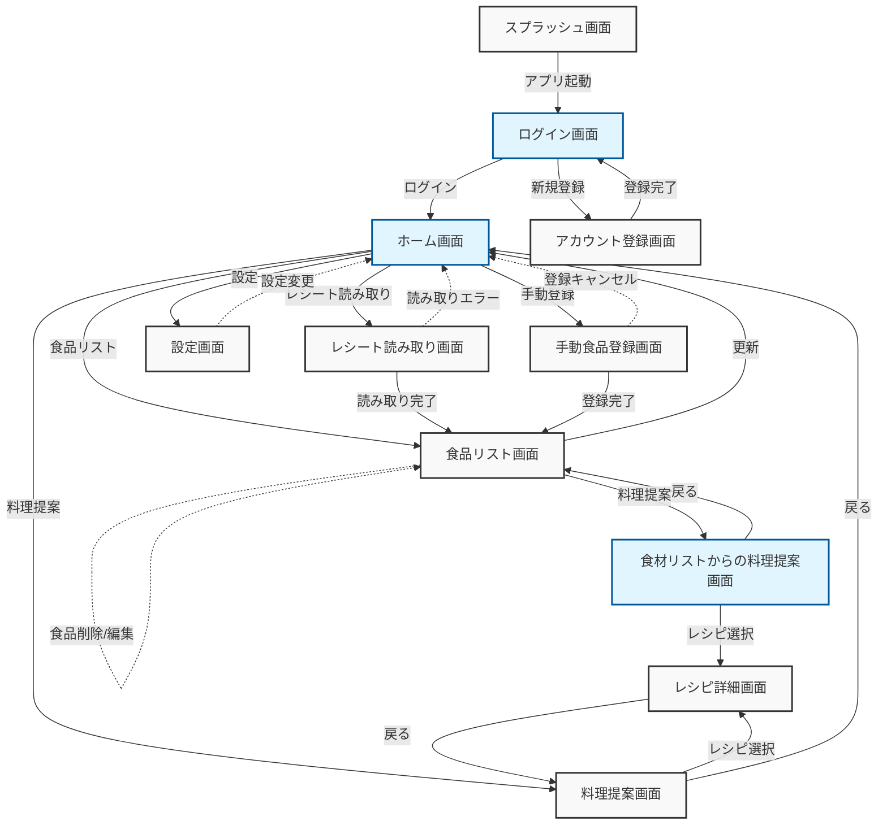

# 食品登録・料理提案アプリの修正画面遷移図

このドキュメントでは、レシート読み取り、食品登録、料理提案機能を持つアプリケーションの画面遷移を図示し、説明します。買い物リスト機能は削除されています。

## 画面遷移図

## 画面説明

1. **スプラッシュ画面**:
   - アプリ起動時に表示される初期画面
   - 自動的にログイン画面へ遷移

2. **ログイン画面**:
   - ユーザー認証を行う
   - ログイン成功後、ホーム画面へ遷移
   - 新規ユーザーはアカウント登録画面へ遷移可能

3. **アカウント登録画面**:
   - 新規ユーザーがアカウントを作成
   - 登録完了後、ログイン画面に戻る

4. **ホーム画面**:
   - アプリのメイン画面
   - 各主要機能へのアクセスポイント
   - レシート読み取り、手動登録、食品リスト、料理提案、設定へのボタンを配置

5. **レシート読み取り画面**:
   - カメラでレシートを読み取る
   - 読み取り完了後、食品リスト画面へ遷移
   - 読み取りエラー時はホーム画面に戻る

6. **手動食品登録画面**:
   - 手動で食品を入力・登録
   - 登録完了後、食品リスト画面へ遷移
   - 登録キャンセル時はホーム画面に戻る

7. **食品リスト画面**:
   - 登録された全ての食品を表示
   - 食品の削除や編集が可能
   - 更新後、ホーム画面に戻ることが可能
   - 「料理提案」ボタンで食材リストからの料理提案画面へ遷移

8. **料理提案画面**:
   - 登録された全ての食品から作れる料理を提案
   - 提案されたレシピを選択すると、レシピ詳細画面へ遷移

9. **レシピ詳細画面**:
   - 選択したレシピの詳細情報を表示
   - 料理提案画面に戻ることが可能

10. **設定画面**:
    - アプリの各種設定を変更
    - 設定変更後、ホーム画面に戻る

11. **食材リストからの料理提案画面**:
    - 食品リスト画面から遷移
    - 現在の食材リストに基づいて作れる料理を提案
    - 提案されたレシピを選択すると、レシピ詳細画面へ遷移
    - 食品リスト画面に戻ることが可能

## まとめ

この修正された画面遷移図は、食品登録・料理提案アプリの主要な機能と画面間の関係を視覚的に表現しています。買い物リスト機能が削除されたことで、アプリの焦点がより明確になり、食材管理と料理提案に集中しています。

主な変更点：
1. 買い物リスト画面の削除
2. レシピ詳細画面から買い物リストへの連携機能の削除

この変更により、アプリケーションの構造がよりシンプルになり、ユーザーは食材の管理と料理提案に集中できるようになりました。開発チームはこの更新された図を基に、アプリケーションの開発や改善を進めることができます。

今後も、ユーザーフィードバックや新たな要件に基づいて、この画面遷移図を適宜更新していくことをお勧めします。ユーザーのニーズに合わせて機能を追加または削除し、アプリの使いやすさと有用性を継続的に向上させていくことが重要です。
